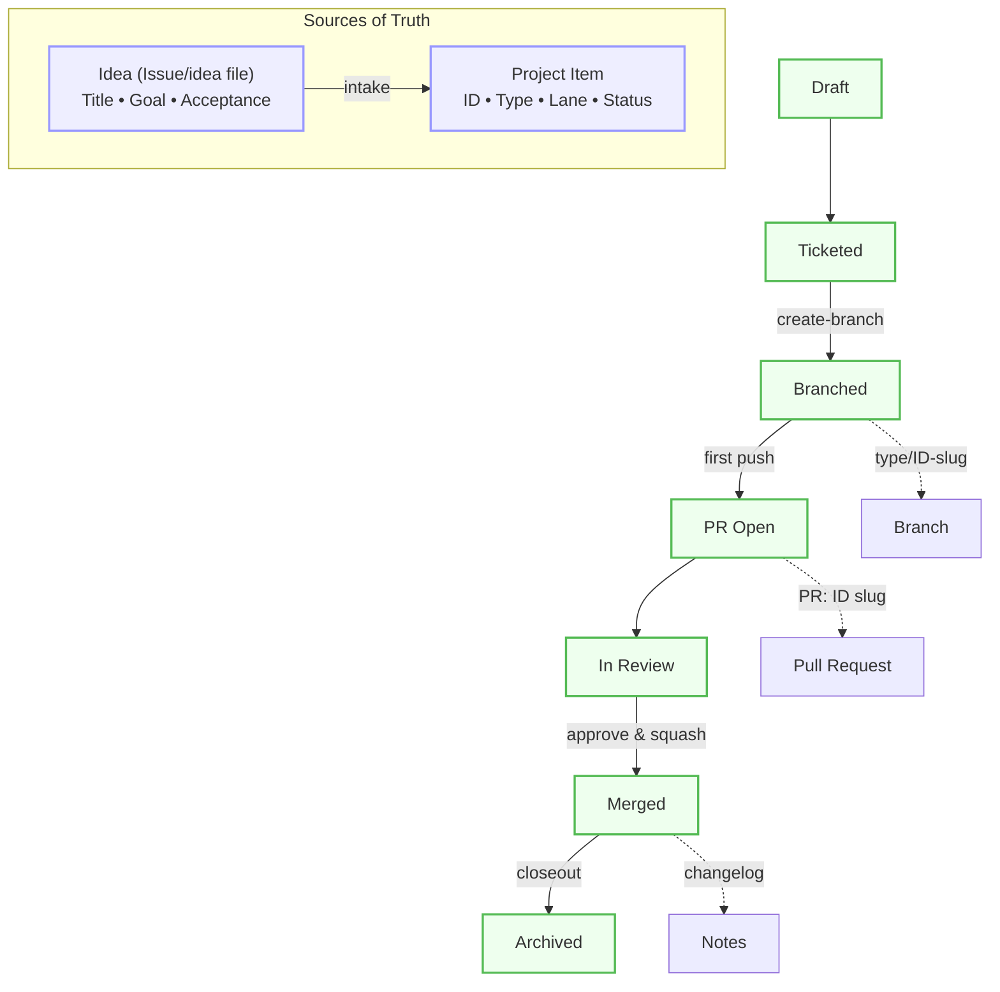

# Idea Lifecycle (Canonical Workflow)

Single truth: content lives in Issues/ideas files. Status lives in GitHub Projects. Project state is authoritative on conflict.

**IDs:** ARCH-n, U-n, C-n, B-n, PB-n  
**States:** Draft → Ticketed → Branched → PR Open → In Review → Merged → Archived

## Workflow Diagram

## RACI (summary)

- Lane D: policy owner, canonical doc, approvals.
- Lane B: Playbook page, narrative, decision visuals.
- Lane A: unit READMEs (scaffold/test/rollback).
- Lane C: enforcement (commit/PR rules, CI checks, dashboards).

## Invariants

- One ID → one branch → one PR.
- PR title starts with [ID].
- Commits: [ID] type(scope): subject (no slugs).
- Project status is authoritative; reconcile updates idea frontmatter.

## Links

- Policy enforcement: /docs/policy/workflow-enforcement.md
- Project schema: /docs/reference/project-schema.md
- Runbooks: /docs/runbooks/
