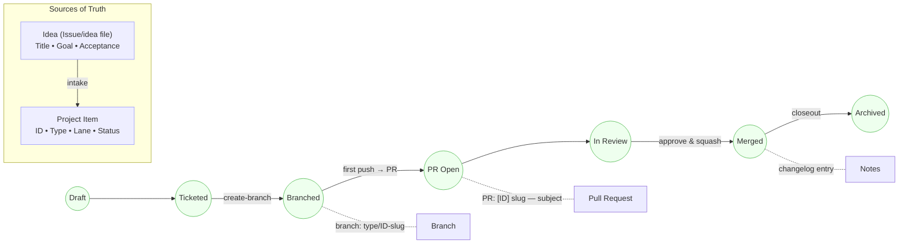

# Idea Lifecycle (Canonical Workflow)

**Single truth:** Content lives in Issues/ideas files; **status** lives in GitHub Projects.  
**IDs:** `ARCH-n`, `U-n`, `C-n`, `B-n`, `PB-n`.  
**States:** Draft → Ticketed → Branched → PR Open → In Review → Merged → Archived.

## RACI (summary)

- Lane D: policy owner, canonical doc, approvals.
- Lane B: Playbook page, narrative, decision visuals.
- Lane A: unit READMEs (scaffold/wire/test/rollback).
- Lane C: enforcement (commit/PR rules, CI checks, dashboards).

## Invariants

One ID → one branch → one PR.

PR title starts with [ID].

Commits: [ID] type(scope): subject (no slugs).

Project status is authoritative; reconcile updates idea frontmatter.

## Links

- Policy enforcement: /docs/policy/workflow-enforcement.md
- Project schema: /docs/reference/project-schema.md
- Runbooks: /docs/runbooks/
- ADR: /docs/adr/2025-10-idea-lifecycle.md
