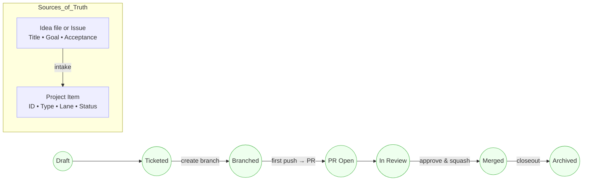

# Idea Lifecycle (Canonical)

Single truth: content lives in Ideas/Issues; status lives in GitHub Projects.

**States:** Draft → Ticketed → Branched → PR Open → In Review → Merged → Archived

## Invariants

- One ID → one branch → one PR.
- PR title starts with [ID].
- Project status is authoritative on conflict.
