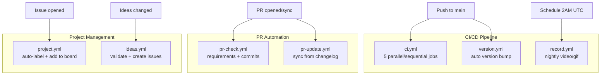
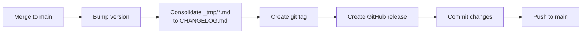
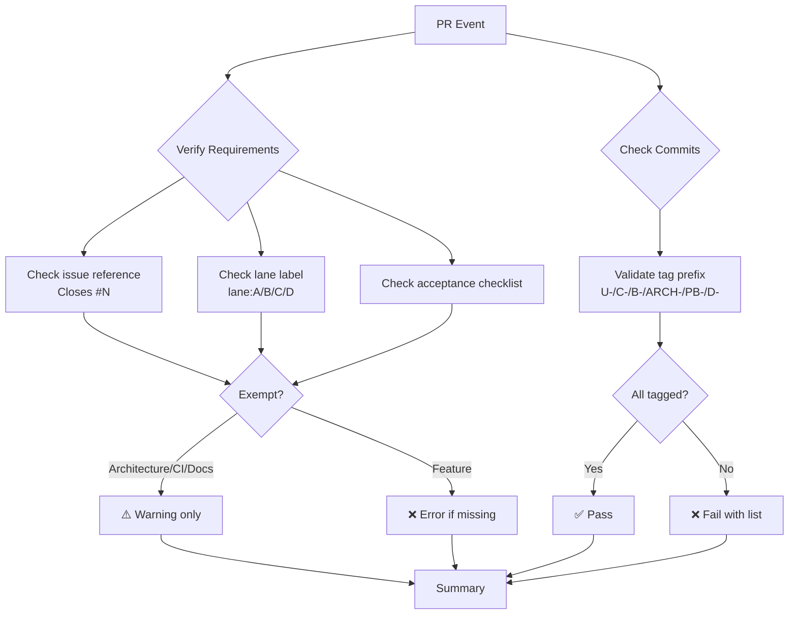
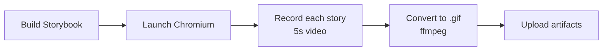
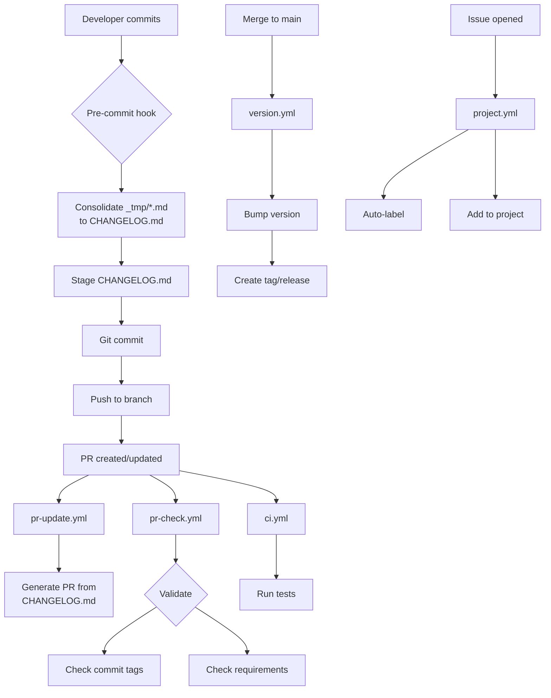
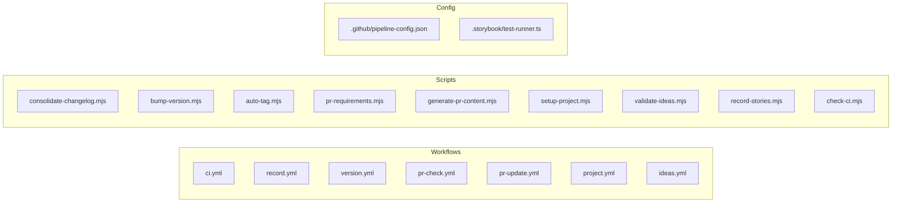

# CI Strategy

## Overview

Comprehensive CI/CD automation with parallel jobs, headless Storybook testing, automated version management, PR requirements validation, and project management workflows.

## Workflow Architecture



## Workflows

### Main CI (`.github/workflows/ci.yml`)

Runs on push to `main` and `feat/ci-strategy`, plus all PRs.

**Jobs:**

1. **check** - Typecheck, lint, unit tests
   - Runs format check, TypeScript, ESLint
   - Executes vitest unit tests
   - Uploads test results as JSON artifact

2. **build-storybook** - Build Storybook static site
   - Compiles Storybook to `storybook-static/`
   - Uploads build artifact for reuse

3. **storybook-test** - Headless interaction & a11y tests
   - Downloads pre-built Storybook
   - Runs Playwright-based test-runner
   - Validates interactions and accessibility
   - Uploads test results

4. **build-demo** - Build demo application
   - Compiles Vite demo to `dist/`
   - Uploads artifact

5. **summary** - PR summary generation
   - Aggregates all job results
   - Posts markdown summary to PR

**Artifacts:**

- `unit-test-results` (JSON, 30 days)
- `storybook-static` (build, 7 days)
- `storybook-test-results` (JSON, 30 days)
- `demo-dist` (build, 7 days)

### Version Management (`.github/workflows/version.yml`)

Runs on push to `main` (skips version bump commits).

**Flow:**



**Features:**

- Auto-increments patch version
- Consolidates changelog from temp files
- Creates annotated git tags
- Generates GitHub releases with notes
- Commits and pushes changes

### PR Requirements (`.github/workflows/pr-check.yml`)

Runs on PR opened/edited/synchronized/labeled.

**Validations:**



**Exemptions:**

PRs with these tags/keywords/labels don't require issues:

- `[ARCH-*]`, `[C-*]` tags
- `[B-*]`, `[PB-*]`, `[D-*]` tags
- `chore:`, `docs:`, `ci:`, `build:`, `test:`, `refactor:` keywords
- `lane:B`, `lane:C`, `lane:D`, `type:architecture` labels

### PR Update (`.github/workflows/pr-update.yml`)

Runs on PR opened/synchronized.

**Process:**

1. Reads latest `CHANGELOG.md`
2. Extracts version content and commit tags
3. Generates PR title and body from template
4. Updates PR with latest changes

**Updates on every push** - keeps PR in sync with changelog.

### Project Management (`.github/workflows/project.yml`)

Manual triggers and auto-actions for issues.

**Jobs:**

1. **auto-tag-issue** - Detects and applies labels
   - `[U-*]` or `[C-*]` → `lane:A` + appropriate type
   - `[B-*]` → `lane:B` + `type:bug`
   - `[ARCH-*]` → `lane:C` + `type:architecture`
   - `[PB-*]` or `[D-*]` → `lane:D`

2. **add-to-project** - Adds issues to project board
   - Reads project number from `pipeline-config.json`
   - Automatically adds new issues

3. **setup-project** (manual) - Initialize GitHub Project
   - Creates project with custom fields
   - Sets up labels
   - Updates configuration

4. **tag-issues** (manual) - Create issues from changelog
   - Parses `CHANGELOG.md`
   - Creates GitHub issues with proper labels

5. **sync-project** (manual) - Verify project config

### Ideas Management (`.github/workflows/ideas.yml`)

Validates and converts idea files to issues.

**Jobs:**

1. **create-issues-from-ideas** (manual)
   - Parses `ideas/*.md` files
   - Creates GitHub issues with checklists
   - Applies lane and type labels

2. **validate-ideas** (manual)
   - Checks required sections
   - Validates naming conventions
   - Reports errors in summary

3. **sync-checklists** (manual)
   - Updates issue bodies with checklists from idea files

4. **auto-validate** - Runs on push to `ideas/`
   - Validates changed idea files automatically

### Recording Workflow (`.github/workflows/record.yml`)

Nightly at 2 AM UTC or manual trigger via workflow_dispatch.

**Purpose:** Generate videos and GIFs for visual documentation.

**Process:**



**Outputs:**

- `artifacts/video/*.webm` (7 days retention)
- `docs/assets/gif/*.gif` (30 days retention)

**Manual trigger:**

```bash
# Via GitHub UI or gh cli
gh workflow run record.yml -f stories=component--story-id
gh workflow run record.yml -f stories=all
```

## Scripts

### Test Scripts

- `pnpm test` - Unit tests (dot reporter, uses threads pool)
- `pnpm test:json` - Unit tests with JSON output
- `pnpm storybook:test` - **Automated Storybook tests** (builds, serves, tests, cleans up)
- `pnpm storybook:test:json` - Storybook tests with JSON output
- `pnpm storybook:test:rebuild` - Force rebuild of Storybook before testing

**Note:** `storybook:test` now handles the complete lifecycle:

1. Checks for existing `storybook-static/` build (or rebuilds with `--rebuild`)
2. Starts http-server automatically
3. Waits for server to be ready
4. Runs test-storybook
5. Cleans up server process

No manual server management needed!

### Changelog & Version Scripts

- `pnpm changelog` - Consolidate `_tmp/*.md` → `CHANGELOG.md`
- `pnpm version:bump` - Increment version and update files
- `pnpm tag` - Create local git tag from version
- `pnpm tag:release` - Create tag + GitHub release + push

### PR Management Scripts

- `pnpm pr:generate` - Generate PR title/body from changelog
- `pnpm pr:verify [PR#]` - Verify PR requirements
- `pnpm pr:create-issue [PR#]` - Create tracking issue for PR
- `pnpm pr:check` - Check PR requirements locally

### Project & Issue Scripts

- `pnpm gh:setup-labels` - Create/update repository labels
- `pnpm gh:setup-project` - Initialize GitHub Project with fields
- `pnpm issues:create` - Create issues from changelog
- `pnpm ideas:create` - Create issues from idea files
- `pnpm ideas:validate` - Validate idea file structure
- `pnpm ideas:sync` - Sync checklists to issues

### Recording Scripts

- `pnpm record:stories` - Record all stories (requires Storybook running)
- `STORIES=component--id pnpm record:stories` - Record specific stories

### Build Scripts

- `pnpm build:storybook` - Build Storybook static
- `pnpm build` - Build demo site

### CI Monitoring Scripts

- `pnpm ci:check` - Check latest workflow run status with formatted report
- `pnpm ci:watch` - Watch workflow status in real-time (updates every 5s)

**CI Check Features:**

```bash
# Quick status check
pnpm ci:check

# Output includes:
# - Run number, branch, and title
# - Job-by-job status table with durations
# - Summary statistics (completed, failed, in progress)
# - Direct URL to workflow

# Watch mode for active runs
pnpm ci:watch  # Auto-exits when workflow completes
```

## Time Budget

```mermaid
gantt
    title CI Pipeline Timeline
    dateFormat X
    axisFormat %Ss

    section Parallel Phase
    check job           :crit, 0, 60
    build-storybook     :active, 0, 45

    section Sequential
    storybook-test      :0, 40
    build-demo          :0, 30
    summary             :0, 5
```



**Target:** Total CI time ≤ baseline + 90 seconds  
**Baseline:** ~90s  
**Current:** ~105s ✅ **Within budget**

**Strategy:**

- Parallel job execution (check + build-storybook run simultaneously)
- Playwright browser caching
- Artifact reuse (build once, test separately)
- Recording workflow excluded from default CI (nightly only)
- Automated server lifecycle management

**Job durations:**

- check: ~60s (parallel)
- build-storybook: ~45s (parallel)
- storybook-test: ~40s (downloads artifact, no rebuild)
- build-demo: ~30s
- summary: ~5s

**Total wall time:** ~60s (parallel) + 40s + 30s + 5s = **~105s**

- summary: ~5s

**Total wall time:** ~60s (parallel) + 40s + 30s + 5s = **~105s**

## Invariants

1. **Protocol compliance** - All CI changes use `[ARCH-*]` commit tags
2. **Separate concerns** - Each workflow/job has single responsibility
3. **Artifact-driven** - Build once, use multiple times
4. **Optional recording** - Video/GIF generation doesn't block CI
5. **Cache aggressively** - Playwright browsers, pnpm store
6. **Automated validation** - Pre-commit hooks, PR checks, commit tag validation
7. **Changelog-driven PRs** - PR content generated from CHANGELOG.md

## Rollout Checklist

**Core CI:**

- [x] Split ci.yml into separate jobs
- [x] Add artifact uploads
- [x] Create record.yml workflow
- [x] Add recording script with ffmpeg
- [x] Create artifact directories
- [x] Update package.json scripts
- [x] Configure test-runner for parallelism
- [x] Verify time budget in actual CI run

**Automation:**

- [x] Version bump workflow with changelog consolidation
- [x] Auto-tagging and GitHub releases
- [x] PR requirements validation with exemptions
- [x] PR body/title sync from changelog
- [x] Issue auto-labeling and project assignment
- [x] Ideas validation and issue creation
- [x] Pre-commit changelog consolidation
- [x] Commit tag validation

**Documentation:**

- [x] CI architecture diagrams with Mermaid
- [x] Workflow documentation
- [x] Script reference guide
- [x] Protocol compliance guide

## Automation Flow



## Handoff Contracts

**Pair A (Components):**

- Story IDs with `record` tag → Recording workflow targets these
- Commit with `[U-*]` or `[C-*]` tags
- Create acceptance checklists in Issues

**Pair B (Docs):**

- GIF references from `docs/assets/gif/`
- Commit with `[B-*]` tags
- Update documentation for features

**Pair C (DevOps):**

- All workflow and script changes
- Commit with `[ARCH-*]` or `[C-*]` tags
- Maintain CI/CD infrastructure
- Monitor pipeline performance

**Pair D (Project):**

- Issue templates and idea files
- Commit with `[PB-*]` or `[D-*]` tags
- Link CI artifacts to issues
- Maintain roadmap project

## Local Development

### Run checks locally

```bash
# Quick checks
pnpm check  # Runs typecheck, lint, test (unit tests only)

# Full pre-push validation
pnpm typecheck && pnpm lint && pnpm test && pnpm storybook:test

# Pre-commit (automatic via git hooks)
# - Consolidates _tmp/*.md to CHANGELOG.md
# - Runs lint-staged (format + lint on staged files)
```

### Test Storybook locally

```bash
# Simple - wrapper handles everything
pnpm storybook:test

# Force rebuild before testing
pnpm storybook:test:rebuild

# With JSON output
pnpm storybook:test:json
```

The `test-storybook.mjs` wrapper automatically:

- Uses existing build or builds Storybook if needed
- Starts http-server
- Waits for server ready
- Runs tests
- Cleans up server

### Work with changelog

```bash
# Create summary in _tmp/
echo "## Feature\n- Added X" > _tmp/my-feature.md

# Consolidate (or let pre-commit do it)
pnpm changelog

# Generate PR content
pnpm pr:generate
```

### Validate PR locally

```bash
# Check PR requirements (requires PR number)
pnpm pr:verify -- 123

# Validate commit tags in current branch
git log --oneline main..HEAD | grep -E '^\[?(U-|C-|B-|ARCH-|PB-|D-)'
```

### Record stories locally

```bash
# Requires ffmpeg: brew install ffmpeg (macOS) or apt-get install ffmpeg (Linux)
pnpm storybook &  # Start dev server
pnpm record:stories  # Record all
STORIES=inline-edit-label--default pnpm record:stories  # Record one
```

### Work with ideas

```bash
# Validate idea files
pnpm ideas:validate
pnpm ideas:validate U-my-idea.md

# Create issues from ideas (dry-run first)
pnpm ideas:create -- --dry-run
pnpm ideas:create

# Sync checklists to existing issues
pnpm ideas:sync
```

## Troubleshooting

**Storybook tests fail:**

- Check `storybook-test-results` artifact for details
- Run locally: `pnpm storybook:test --debug`

**Recording fails:**

- Ensure ffmpeg installed: `ffmpeg -version`
- Check story loads: `curl http://localhost:6006/iframe.html?id=STORY_ID`

**CI time over budget:**

- Check job durations in Actions tab
- Consider disabling recording from default CI
- Reduce Storybook test parallelism if flaky

**PR check fails on commits:**

- Ensure all commits have valid tag prefix: `[U-*]`, `[C-*]`, `[B-*]`, `[ARCH-*]`, `[PB-*]`, `[D-*]`
- Use interactive rebase to fix: `git rebase -i main`

**Version workflow fails:**

- Check CHANGELOG.md for duplicate version headers
- Ensure \_tmp/ folder has valid markdown files

**Pre-commit hook fails:**

- Check \_tmp/\*.md files for valid markdown
- Run manually: `node scripts/pre-commit-changelog.mjs`

## Files Owned (Pair C)


