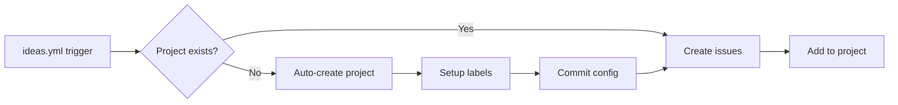

# ARCH-ideas-pipeline

Lane: C (DevOps & Automation)
Issue: #19

## Lane

- **Primary Lane:** C (DevOps & Automation)
- **Labels:** automation, pipeline

## Purpose

Automate GitHub project provisioning so idea cards convert to issues with consistent project placement and configuration.

## Problem

Teams running `ideas.yml` on new repositories must manually create the target project and configure views before the workflow succeeds. The lack of automation means:

- First-time runs fail when `pipeline-config.json` references a non-existent project.
- Manual setup drifts from the scripted expectations, breaking automation.
- There's no self-healing path if the project is renamed or deleted.

## Proposal

Add automated project creation to the `ideas.yml` workflow that:

1. Checks if a project exists in `pipeline-config.json`
2. Verifies the project is still valid in GitHub
3. Auto-creates "Plaincraft Roadmap" project if missing
4. Sets up labels and configuration
5. Commits the config back to repo
6. Proceeds with issue creation

## Architecture

## Components

- `.github/workflows/ideas.yml` - New `ensure-project` job
- `scripts/ops/setup-project.mjs` - Reused for creation
- `.github/pipeline-config.json` - Auto-committed config

## Invariants

- Project creation is idempotent (safe to re-run)
- Configuration commits use `[skip ci]` to prevent loops
- Job outputs propagate project info to dependent jobs
- Manual workflow (`project.yml`) remains available for advanced setup

## Acceptance Checklist

- [x] Auto-detects missing/invalid project configuration
- [x] Creates project with proper fields and views
- [x] Commits config updates automatically
- [x] Downstream `create-issues-from-ideas` job depends on project existence
- [x] Job summary shows whether project was created or reused
- [x] CI-STRATEGY.md updated with automation documentation
- [x] Zero manual setup required for first-time users

## Rollout Notes

- Existing projects unaffected (detection works)
- New repos get zero-config project setup
- Self-healing if project deleted
- Uses same setup script as manual workflow for consistency
