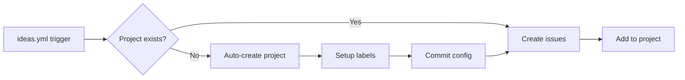

# ARCH-ideas-pipeline

Lane: C
Purpose: Automate project creation and issue linking when converting ideas to GitHub issues.

## Problem

When running `ideas-to-issues.mjs`, issues are created but fail to be added to the project board if no project exists. Manual project setup via `gh:setup-project` is required first, creating friction in the ideas-to-issues workflow.

## Solution

Add automated project creation to the `ideas.yml` workflow that:

1. Checks if a project exists in `pipeline-config.json`
2. Verifies the project is still valid in GitHub
3. Auto-creates "Plaincraft Roadmap" project if missing
4. Sets up labels and configuration
5. Commits the config back to repo
6. Proceeds with issue creation

## Architecture

## Components

- `.github/workflows/ideas.yml` - New `ensure-project` job
- `scripts/setup-project.mjs` - Reused for creation
- `.github/pipeline-config.json` - Auto-committed config

## Invariants

- Project creation is idempotent (safe to re-run)
- Configuration commits use `[skip ci]` to prevent loops
- Job outputs propagate project info to dependent jobs
- Manual workflow (`project.yml`) remains available for advanced setup

## Acceptance Checklist

- [ ] `ensure-project` job added to ideas workflow
- [ ] Auto-detects missing/invalid project configuration
- [ ] Creates project with proper fields and views
- [ ] Commits config updates automatically
- [ ] Downstream `create-issues-from-ideas` job depends on project existence
- [ ] Job summary shows whether project was created or reused
- [ ] CI-STRATEGY.md updated with automation documentation
- [ ] Zero manual setup required for first-time users

## Rollout Notes

- Existing projects unaffected (detection works)
- New repos get zero-config project setup
- Self-healing if project deleted
- Uses same setup script as manual workflow for consistency
